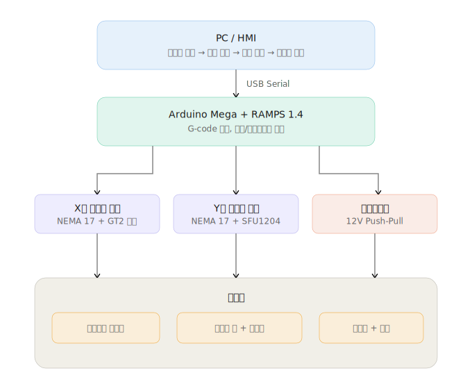
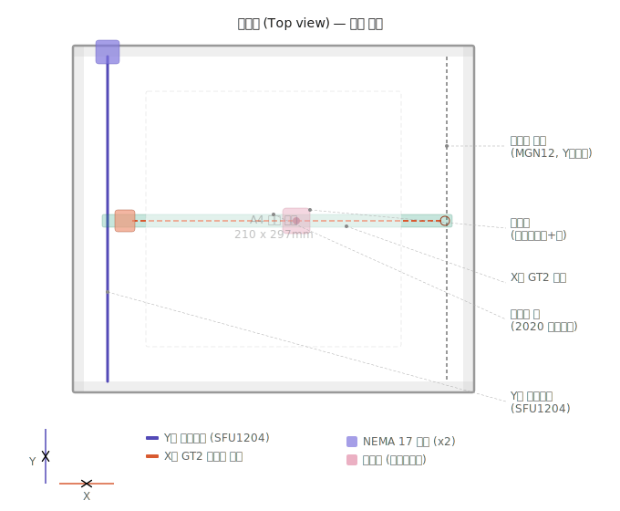
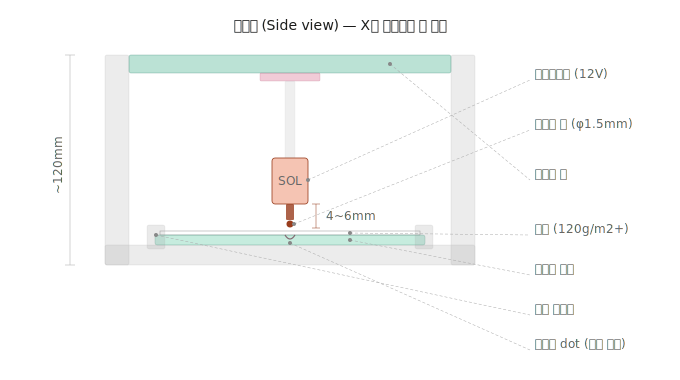

# 저비용 점자 엠보서 제작 프로젝트 계획서


## 1. 개요 및 실효성

### 1.1 배경

점자(Braille)는 시각장애인이 촉각으로 문자를 읽을 수 있도록 고안된 문자 체계로, 2열 3행의 6개 돌출점 조합으로 구성된다. 점자 인쇄물은 일반 프린터로는 제작할 수 없으며, 별도의 점자 프린터(엠보서)가 필요하다.

현재 상용 점자 프린터는 최소 수백만 원에서 수천만 원에 이르는 가격대로 형성되어 있어, 개인이나 소규모 기관에서 구매하기에는 경제적 부담이 크다. 이로 인해 점자 인쇄물의 접근성이 제한되고 있으며, 특히 저소득 시각장애인이나 개발도상국의 교육 현장에서 그 문제가 두드러진다.

### 1.2 프로젝트 목표

한글 텍스트를 입력하면 한국 점자 규정에 부합하는 물리적 규격으로 종이에 점자를 엠보싱하는 장치를 제작한다. 전체 제작비를 30만 원 이내로 유지하면서, 실제 촉각 인식이 가능한 수준의 출력 품질을 확보하는 것을 목표로 한다.

### 1.3 기존 오픈소스 프로젝트 분석

BrailleRAP(braillerap.org)은 현재 가장 완성도 높은 오픈소스 점자 엠보서로, 3D 프린터(RepRap) 컨트롤러 기반으로 설계되어 약 350달러 수준에서 제작이 가능하다. CERN OHL 라이선스로 공개되어 있으며, 세계 각지에서 재현 사례가 보고되고 있다. 본 프로젝트는 BrailleRAP의 기구 설계를 참고하되, 한글 점자 변환 엔진과 HMI를 자체 개발하여 차별화한다.


## 2. 시스템 아키텍처

전체 시스템은 PC 소프트웨어, 제어 보드, 기구부의 세 계층으로 구성된다.



### 2.1 데이터 흐름

```
[PC / HMI 소프트웨어]
  한글 텍스트 입력
    → 한글-점자 변환 (초성/중성/종성 분해 → 점자 코드 매핑)
    → 점자 배열을 2D bit 배열로 생성
    → 물리적 좌표 계산 (규격 기반 상수 적용)
    → G-code 생성
    → USB Serial 전송
        ↓
[Arduino Mega + RAMPS 1.4]
  G-code 수신 및 해석 (Marlin 펌웨어)
    → X축 스테퍼 모터 제어 (캐리지 좌우 이동)
    → Y축 스테퍼 모터 제어 (갠트리 전후 이동)
    → 솔레노이드 ON/OFF (엠보싱 타격)
        ↓
[기구부]
  XY 직교 로봇이 A4 용지 영역을 순회하며
  솔레노이드로 점자 dot을 엠보싱
```

### 2.2 제어 구성

- 메인 컨트롤러: Arduino Mega 2560 호환보드
- 모터 드라이버 보드: RAMPS 1.4
- 스테퍼 드라이버: DRV8825 (1/32 마이크로스테핑 지원)
- 펌웨어: Marlin (3D 프린터용 오픈소스 펌웨어, G-code 해석기 내장)
- 통신: USB Serial (PC → Arduino, 115200 baud)

RAMPS 1.4 보드는 스테퍼 모터 최대 5축, 히터, 팬, 엔드스톱 등을 제어할 수 있으며, 본 프로젝트에서는 X/Y 2축 스테퍼와 솔레노이드 제어에 활용한다. 솔레노이드는 RAMPS의 FAN 또는 HEATER 핀을 통해 MOSFET으로 ON/OFF 제어한다.


## 3. 하드웨어 구조

### 3.1 전체 기구 구성

본 장치는 XY 직교 로봇(갠트리) 방식을 채택한다. A4 용지를 받침대 위에 고정하고, 갠트리 위의 캐리지가 XY 평면을 이동하면서 솔레노이드로 점자를 엠보싱한다.





주요 구성 요소는 다음과 같다.

프레임: 2020 알루미늄 프로파일로 조립. 전체 크기 약 500mm x 450mm. A4 용지(210mm x 297mm)를 완전히 커버하는 작업 영역 확보.

Y축 (갠트리 전후 이동): SFU1204 볼 스크류 1개가 프레임 한쪽에 설치되고, 반대쪽에는 MGN12 리니어 레일이 설치되어 갠트리 빔을 지지한다. NEMA 17 스테퍼 모터가 커플링을 통해 볼 스크류를 회전시킨다.

X축 (캐리지 좌우 이동): GT2 타이밍 벨트 + 20T 풀리 조합으로 캐리지를 이동시킨다. MGN12 리니어 레일 위에 캐리지가 장착되며, NEMA 17 스테퍼 모터가 풀리를 구동한다.

갠트리 빔: X축 리니어 레일과 벨트가 설치되는 가로 빔. 2020 또는 2040 프로파일 사용.

캐리지: 솔레노이드와 엠보싱 핀이 장착되는 이동체. 3D 프린트 또는 알루미늄 판으로 제작.

받침대: 실리콘 또는 고무 패드. 솔레노이드가 종이를 눌렀을 때 반대쪽으로 볼록하게 올라오도록 적절한 경도의 소재를 선정한다.

용지 고정: 프로파일 양측에 클램프 또는 볼트 조임 방식으로 용지를 고정.

원점 복귀: X축, Y축 각각 리미트 스위치 설치. 전원 인가 시 홈 위치로 복귀하여 좌표 기준점을 설정.


### 3.2 축 구동 방식 비교

본 프로젝트에서는 Y축에 볼 스크류, X축에 타이밍 벨트를 사용하는 혼합 구조를 채택한다. 아래는 세 가지 구성 옵션의 비교이다.

#### 옵션 A: 볼 스크류 + 볼 스크류

X축, Y축 모두 SFU1204 볼 스크류를 사용한다.

| 항목 | 사양 |
|------|------|
| 정밀도 | C7 등급: ±0.05mm/300mm |
| 축당 최대 속도 | ~13mm/s (리드 4mm, 200rpm 기준) |
| 동력부 예상 비용 | ~153,000원 |
| 조립 난이도 | 쉬움 (벨트 텐션 조절 불필요) |

장점: 구조가 직관적이며, 백래시가 거의 없고, 벨트 텐션 조절이 필요 없어 시행착오가 적다.
단점: 속도가 느리고, 부품비가 가장 높으며, Y축에 2개 스크류를 사용할 경우 정렬이 까다롭다.


#### 옵션 B: 타이밍 벨트 (X) + 볼 스크류 (Y) — 채택

X축은 GT2 타이밍 벨트, Y축은 SFU1204 볼 스크류를 사용한다.

| 항목 | 사양 |
|------|------|
| X축 정밀도 | ~0.1mm (GT2 벨트 + 20T 풀리, 1/16 스테핑) |
| Y축 정밀도 | ±0.05mm/300mm (C7 등급) |
| X축 최대 속도 | ~60mm/s |
| Y축 최대 속도 | ~13mm/s |
| 동력부 예상 비용 | ~95,000원 |
| 조립 난이도 | 중간 |

장점: X축이 빠르게 이동하여 인쇄 시간이 단축된다. Y축은 볼 스크류로 단단하게 잡아 엠보싱 충격에 안정적이다. 모터 2개로 충분하며, 비용도 절감된다.
단점: X축 벨트 텐션 조절이 1곳 필요하다.

채택 사유: 점자 인쇄 시 X축 이동이 압도적으로 많다. 셀 내부 dot 간 이동(2.5mm)과 셀 간 이동(6mm)이 모두 X 방향이며, Y축은 줄바꿈(10mm) 시에만 이동한다. 따라서 X축에 빠른 벨트, Y축에 안정적인 볼 스크류를 배치하는 것이 효율적이다. 또한 솔레노이드 타격 시 발생하는 충격이 Y축 갠트리를 밀어낼 수 있는데, 볼 스크류는 자체 잠금(self-locking) 특성이 있어 이를 방지한다.


#### 옵션 C: 타이밍 벨트 + 타이밍 벨트

X축, Y축 모두 GT2 타이밍 벨트를 사용한다.

| 항목 | 사양 |
|------|------|
| 정밀도 | ~0.1mm (양축 동일) |
| 축당 최대 속도 | ~60mm/s 이상 |
| 동력부 예상 비용 | ~45,000원 |
| 조립 난이도 | 중간~높음 |

장점: 가장 저렴하고 가장 빠르며, DIY 펜 플로터 등 레퍼런스가 풍부하다.
단점: 양축 모두 벨트 텐션 조절이 필요하고, 엠보싱 충격 시 벨트가 순간적으로 밀릴 수 있어 dot 위치 정밀도가 저하될 가능성이 있다.


### 3.3 주요 부품 상세

#### 스테퍼 모터: NEMA 17

스텝 각도 1.8도 (풀스텝 기준 200 step/rev). 1/16 마이크로스테핑 적용 시 3200 step/rev. 홀딩 토크 약 40Ncm 이상의 모델 선정. 12V 구동. 본 프로젝트에서는 X축 1개, Y축 1개, 총 2개를 사용한다.

#### 솔레노이드: 12V DC Push-Pull

스트로크 4~6mm, 12V DC 구동. 응답 시간 수십 ms 수준. 종이를 변형시킬 수 있는 충분한 힘(최소 3~5N)을 가진 모델을 선정한다. RAMPS 보드의 MOSFET 출력 핀을 통해 ON/OFF 제어하며, 플라이백 다이오드를 병렬 연결하여 역기전력으로부터 회로를 보호한다.

힘이 부족할 경우 레버 구조를 활용하여 힘을 증폭시키는 방법도 고려한다.

#### 엠보싱 핀

지름 약 1.5mm의 둥근 끝 스테인리스 핀을 사용한다. 점자 dot의 지름 규격(1.5~1.6mm)에 맞추기 위함이다. 바늘로 종이를 뚫는 방식이 아니라, 뭉툭한 핀으로 종이를 밀어서 볼록하게 올라오게 하는 엠보싱 방식을 사용한다. 이 방식이 촉각 인식에 더 유리하며, 점자 제작의 표준적인 방법이다.

#### 제어 보드: Arduino Mega + RAMPS 1.4 + DRV8825

Arduino Mega 2560은 54개의 디지털 I/O 핀과 16개의 아날로그 입력을 가진 마이크로컨트롤러 보드로, RAMPS 1.4 실드를 장착하면 CNC/3D 프린터 제어에 최적화된 플랫폼이 된다. DRV8825 스테퍼 드라이버는 최대 1/32 마이크로스테핑을 지원하며, 본 프로젝트에서는 1/16 스테핑을 사용한다.

이 조합은 3D 프린터 및 DIY CNC 커뮤니티에서 수년간 검증된 구성이며, Marlin 펌웨어가 기본 지원된다.


## 4. 점자 규격 및 하드웨어 스펙 비교

### 4.1 한국 점자 물리적 규격 (종이 재질 기준)

2020년 문화체육관광부 고시 '한국 점자 규정' 개정에 따른 종이 재질 점자 물리적 규격은 다음과 같다.

| 항목 | 최솟값 | 최댓값 |
|------|--------|--------|
| 점 높이 | 0.6mm | 0.9mm |
| 점 지름 | 1.5mm | 1.6mm |
| 점간 거리 (셀 내부) | 2.3mm | 2.5mm |
| 자간 거리 (셀 사이) | 5.5mm | 6.9mm |
| 줄간 거리 | - | 약 10.0mm |

점자 용지 규격: 191mm x 270mm 또는 전산 용지 242mm x 280mm. 두께 최소 120g/m2 이상.


### 4.2 하드웨어 스펙과 규격 충족 여부

| 요구 사항 | 규격 값 | 본 장치 스펙 | 충족 여부 |
|-----------|---------|-------------|-----------|
| 점간 위치 정밀도 | 2.3mm 간격 (±0.2mm 이내 필요) | X축: ~0.1mm, Y축: ±0.05mm | 충족 |
| 점 지름 | 1.5~1.6mm | 핀 지름 1.5mm 선정 | 충족 |
| 점 높이 | 0.6~0.9mm | 솔레노이드 힘 + 패드 경도로 조절 | 테스트 후 조절 |
| 작업 영역 | A4 (210 x 297mm) | X: ~250mm, Y: ~350mm | 충족 |
| 용지 두께 | 120g/m2 이상 | 고정 클램프 방식 대응 | 충족 |

점 높이(0.6~0.9mm)는 솔레노이드의 힘, 핀의 스트로크, 받침 패드의 경도에 의해 결정되므로, 제작 후 실물 테스트를 통해 최적값을 찾아야 한다. 이 부분이 프로젝트의 핵심 튜닝 포인트이다.


### 4.3 예상 인쇄 시간

한글 200자 기준, 평균 dot 3개/셀, A4 1페이지 기준 추정치이다.

계산 조건:
- 총 dot 수: 약 600개
- 셀 내부 dot 이동 거리: 2.5mm
- 셀 간 이동 거리: 6.0mm
- 줄바꿈 이동 거리: 10.0mm
- 솔레노이드 1회 타격 시간: 50ms
- 줄당 셀 수: 약 32개

| 구성 | X축 속도 | Y축 속도 | 200자 예상 시간 |
|------|---------|---------|----------------|
| 볼스크류 + 볼스크류 | 13 mm/s | 13 mm/s | 약 3분 |
| 벨트 + 볼스크류 (채택) | 60 mm/s | 13 mm/s | 약 1분 30초 |
| 벨트 + 벨트 | 60 mm/s | 60 mm/s | 약 1분 10초 |

채택한 혼합 구성(벨트+볼스크류)의 인쇄 시간은 약 1분 30초로, 프로토타입 수준에서 실용적인 범위이다. 경로 최적화(dot 순서를 최단 이동 경로로 정렬)를 적용하면 추가 단축도 가능하다.


## 5. BOM 및 예산

### 5.1 부품 목록 (Bill of Materials)

#### 제어부

| 부품 | 수량 | 예상 단가 | 소계 |
|------|------|----------|------|
| Arduino Mega 2560 호환보드 | 1 | 10,000 | 10,000 |
| RAMPS 1.4 보드 | 1 | 12,000 | 12,000 |
| DRV8825 스테퍼 드라이버 | 2 | 3,000 | 6,000 |
| 12V 5A SMPS 전원공급기 | 1 | 10,000 | 10,000 |

#### 구동부

| 부품 | 수량 | 예상 단가 | 소계 |
|------|------|----------|------|
| NEMA 17 스테퍼 모터 (40Ncm+) | 2 | 8,000 | 16,000 |
| 12V Push-Pull 솔레노이드 | 1 | 5,000 | 5,000 |
| 솔레노이드 구동 MOSFET 모듈 | 1 | 2,000 | 2,000 |

#### 동력전달부 (Y축: 볼 스크류)

| 부품 | 수량 | 예상 단가 | 소계 |
|------|------|----------|------|
| SFU1204 볼스크류+너트 (350mm) | 1 | 15,000 | 15,000 |
| BK/BF10 서포트 유닛 | 1세트 | 10,000 | 10,000 |
| 플렉시블 커플링 (6.35x8mm) | 1 | 3,000 | 3,000 |
| MGN12 리니어 레일+블록 (350mm) | 2 | 15,000 | 30,000 |

#### 동력전달부 (X축: 타이밍 벨트)

| 부품 | 수량 | 예상 단가 | 소계 |
|------|------|----------|------|
| GT2 타이밍 벨트 (1m) | 1 | 2,000 | 2,000 |
| GT2 풀리 (20T) | 1 | 2,000 | 2,000 |
| GT2 아이들러 풀리 | 1 | 2,000 | 2,000 |
| MGN12 리니어 레일+블록 (300mm) | 1 | 15,000 | 15,000 |

#### 프레임 및 기구부

| 부품 | 수량 | 예상 단가 | 소계 |
|------|------|----------|------|
| 2020 알루미늄 프로파일 (300mm) | 6 | 3,000 | 18,000 |
| 프로파일 브라켓, 너트, 볼트 세트 | 1 | 15,000 | 15,000 |
| 엠보싱 핀 (φ1.5mm 둥근 끝) | 3 | 1,000 | 3,000 |
| 실리콘/고무 패드 (받침용) | 1 | 5,000 | 5,000 |
| 리미트 스위치 (원점 복귀용) | 2 | 1,000 | 2,000 |

#### 기타

| 부품 | 수량 | 예상 단가 | 소계 |
|------|------|----------|------|
| 배선, 커넥터, 나사류 등 | 1 | 15,000 | 15,000 |
| 3D 프린트 파트 (헤드, 마운트 등) | - | 10,000 | 10,000 |


### 5.2 예산 요약

| 구분 | 금액 |
|------|------|
| 부품 합계 | 208,000원 |
| 예비비 (20%) | 42,000원 |
| 총 예상 비용 | 약 250,000원 |

알리익스프레스 기준 예상가이며, 국내 구매 시 1.3~1.5배 상승할 수 있다. 3D 프린트 파트는 학교 장비 사용을 가정한다. 예산 상한 50만 원 대비 넉넉한 여유가 있다.


## 6. 소프트웨어 구조

### 6.1 전체 소프트웨어 스택

소프트웨어는 크게 세 계층으로 구분된다.

PC 애플리케이션 (C# 또는 Python): 사용자 인터페이스, 한글-점자 변환, 좌표 계산, G-code 생성 및 시리얼 전송을 담당한다.

Marlin 펌웨어 (Arduino): G-code를 수신하여 스테퍼 모터와 솔레노이드를 제어한다. 가감속 프로파일, 원점 복귀(homing), 좌표 시스템 관리를 처리한다.

GRBL 대안: Marlin 대신 GRBL 펌웨어를 사용할 수도 있다. GRBL은 Arduino Uno에서도 동작하며, 2축 CNC에 더 가볍고 간결한 선택이다. 단, Arduino Uno 사용 시 RAMPS 대신 CNC Shield를 사용해야 한다.


### 6.2 한글 → 점자 변환 로직

한글 유니코드 음절(가~힣, U+AC00~U+D7A3)을 초성, 중성, 종성으로 분해한 뒤, 각각에 대응하는 점자 코드로 매핑한다.

분해 공식:
```
한글 유니코드 값 = 0xAC00 + (초성 인덱스 × 21 + 중성 인덱스) × 28 + 종성 인덱스
```

역으로:
```
코드값 = 유니코드값 - 0xAC00
초성 인덱스 = 코드값 / (21 × 28)
중성 인덱스 = (코드값 % (21 × 28)) / 28
종성 인덱스 = 코드값 % 28
```

각 초성/중성/종성에 대응하는 6-dot 점자 코드표를 미리 정의하고, 분해된 결과를 순차적으로 점자 셀 배열로 변환한다. 한글 점자는 풀어쓰기 방식이므로, 한 음절이 2~5개의 점자 셀로 변환될 수 있다.


### 6.3 점자 배열 → 물리 좌표 변환

점자 셀은 2열 3행의 6개 dot으로 구성된다. 각 dot의 셀 내부 상대 좌표는 다음과 같다 (단위: mm).

```
dot1 (0.0, 0.0)    dot4 (2.5, 0.0)
dot2 (0.0, 2.5)    dot5 (2.5, 2.5)
dot3 (0.0, 5.0)    dot6 (2.5, 5.0)
```

n번째 셀의 기준점 (셀 좌상단 dot1의 위치):
```
cellX = marginX + cellIndex × cellSpacing
cellY = marginY + lineIndex × lineSpacing
```

여기서 cellSpacing = 6.0mm (자간 거리), lineSpacing = 10.0mm (줄간 거리).

각 dot의 절대 좌표:
```
absoluteX = cellX + dotOffsetX
absoluteY = cellY + dotOffsetY
```


### 6.4 G-code 생성

점자 dot 좌표 목록을 순서대로 G-code 명령어로 변환한다. 사용하는 주요 G-code 명령어는 다음과 같다.

```
G28          ; 원점 복귀 (홈 위치로 이동)
G90          ; 절대 좌표 모드
G21          ; 단위: mm
G1 Xn.n Yn.n Fnnnn  ; 지정 좌표로 이동 (F: 이동 속도 mm/min)
M106 S255    ; 솔레노이드 ON (FAN 핀 활용, PWM 최대)
G4 P50       ; 50ms 대기 (솔레노이드 타격 유지)
M107         ; 솔레노이드 OFF
```

한 개의 dot을 찍는 시퀀스:
```
G1 X12.5 Y10.0 F3600   ; 해당 dot 위치로 이동 (60mm/s = 3600mm/min)
M106 S255               ; 솔레노이드 ON
G4 P50                   ; 50ms 유지
M107                     ; 솔레노이드 OFF
```

이 시퀀스를 모든 dot에 대해 반복하면 전체 페이지가 인쇄된다.

경로 최적화: dot 좌표를 단순히 좌에서 우, 위에서 아래 순서로 정렬하는 것이 기본이지만, 줄별로 홀수 줄은 좌→우, 짝수 줄은 우→좌로 교대 정렬(래스터 방식)하면 불필요한 이동을 줄일 수 있다.


### 6.5 PC 애플리케이션 구성

HMI(Human Machine Interface)에는 다음 요소가 포함된다.

텍스트 입력 영역: 한글 텍스트를 입력하는 텍스트 박스.

변환 버튼: 입력된 텍스트를 점자로 변환하고 미리보기를 갱신한다.

점자 미리보기: 변환 결과를 시각적으로 표시. 각 dot의 위치를 화면에 원으로 렌더링하여 실제 인쇄 결과를 미리 확인할 수 있다.

시리얼 포트 선택: Arduino가 연결된 COM 포트를 선택하는 드롭다운.

인쇄 버튼: 생성된 G-code를 시리얼로 전송하여 인쇄를 시작한다.

개발 언어는 C#(WPF 또는 WinForms) 또는 Python(Tkinter, PyQt)을 사용한다.


### 6.6 Marlin 펌웨어 주요 설정

Marlin 펌웨어의 Configuration.h에서 변경이 필요한 주요 항목은 다음과 같다.

```
#define DEFAULT_AXIS_STEPS_PER_UNIT   { X_STEPS, Y_STEPS, 1, 1 }
```

X축 (GT2 벨트 + 20T 풀리, 1/16 마이크로스테핑):
```
steps/mm = (200 steps × 16 microsteps) / (20 teeth × 2mm pitch)
         = 3200 / 40 = 80 steps/mm
```

Y축 (SFU1204 볼 스크류, 리드 4mm, 1/16 마이크로스테핑):
```
steps/mm = (200 steps × 16 microsteps) / 4mm lead
         = 3200 / 4 = 800 steps/mm
```

따라서:
```
#define DEFAULT_AXIS_STEPS_PER_UNIT   { 80, 800, 1, 1 }
#define DEFAULT_MAX_FEEDRATE          { 60, 13, 1, 1 }  // mm/s
#define DEFAULT_MAX_ACCELERATION      { 500, 200, 1, 1 }
```


## 7. 개발 일정 (8주)

### Phase 1: 부품 조달 및 기초 세팅 (1~2주차)

- 부품 발주 (알리익스프레스 배송 기간 감안하여 가능한 한 빠르게)
- 프로파일 프레임 설계 및 조립
- Arduino + RAMPS 보드 조립, Marlin 펌웨어 업로드
- 스테퍼 모터 단품 구동 테스트 (방향, 속도, 스텝 확인)
- 솔레노이드 단품 구동 테스트 (ON/OFF, 응답 시간, 힘 확인)

### Phase 2: 기구부 조립 및 구동 (3~4주차)

- Y축 조립: 볼 스크류 + 서포트 유닛 + 리니어 레일 설치, 갠트리 빔 장착
- X축 조립: 타이밍 벨트 + 풀리 + 리니어 레일 설치, 캐리지 장착
- 리미트 스위치 설치 및 홈 동작 확인
- Marlin steps/mm 설정 후 실측 검증 (눈금자로 이동 거리 비교)
- 캐리지에 솔레노이드 + 엠보싱 핀 장착
- 수동 G-code 입력으로 XY 이동 + 솔레노이드 타격 기본 동작 확인

### Phase 3: 소프트웨어 개발 (5~6주차)

- 한글 → 점자 변환 엔진 구현 (초성/중성/종성 분해, 점자 코드표 매핑)
- 점자 배열 → 물리 좌표 변환 모듈 구현
- 좌표 → G-code 생성 모듈 구현
- 시리얼 통신 모듈 구현 (COM 포트 연결, G-code 전송, 응답 대기)
- HMI 화면 구현 (텍스트 입력, 점자 미리보기, 인쇄 버튼)

### Phase 4: 통합 테스트 및 최적화 (7~8주차)

- 소프트웨어-하드웨어 통합: 텍스트 입력 → 점자 인쇄 전체 플로우 검증
- 엠보싱 품질 튜닝: 솔레노이드 힘, 핀 높이, 받침 패드 경도 조절
- 점자 규격 적합성 검증: 점간 거리, 자간 거리, 점 높이를 실측하여 규격 범위 내 확인
- 다양한 한글 텍스트로 변환 정확성 검증
- 발표 자료 작성 및 시연 준비


### 일정 요약

| 주차 | 주요 작업 | 산출물 |
|------|----------|--------|
| 1~2주 | 부품 조달, 프레임 조립, 단품 테스트 | 구동 가능한 개별 부품 |
| 3~4주 | 기구부 조립, 축 구동 검증 | XY 이동 + 엠보싱 가능한 하드웨어 |
| 5~6주 | 소프트웨어 개발 | 한글→G-code 변환 + HMI |
| 7~8주 | 통합 테스트, 품질 튜닝 | 완성된 프로토타입 + 발표 자료 |

회사 근무와 학교 수업을 병행하는 상황을 감안하여, 평일 저녁 1~2시간 + 주말 활용 기준으로 8주(2개월) 내 완료를 목표로 한다.
